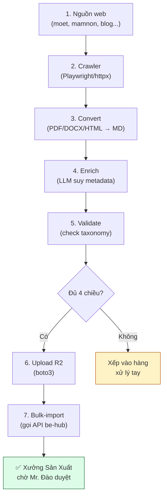

---

# 🕷️ Kế hoạch xây dựng Hệ thống Cào tài liệu tham khảo cho Não AI IruKa

> **Ngày:** 08-07-2026
> **Repo:** dev-ops (giao nhân viên phát triển tool riêng, không đụng be-hub/curriculum-brain)
> **Loại:** Kế hoạch triển khai — giao nhân viên làm
> **Người duyệt:** Mr. Đào (IruKa)
> **Kết quả mong đợi:** 1 tool tự động cào + chuẩn hoá + nạp tài liệu vào Xưởng Sản Xuất (`cur.irukaedu.vn/xuong-san-xuat`) đúng chuẩn danh mục IruKa, không cần thao tác tay.

---

## 📑 Mục lục

1. [Vì sao cần hệ thống này](#1--vì-sao-cần-hệ-thống-này)
2. [Mục tiêu cuối cùng](#2--mục-tiêu-cuối-cùng)
3. [Ai làm — kỹ năng cần có](#3--ai-làm--kỹ-năng-cần-có)
4. [Dữ liệu đầu vào — cào từ đâu, cào cái gì](#4--dữ-liệu-đầu-vào--cào-từ-đâu-cào-cái-gì)
5. [Chuẩn phân loại IruKa (BẮT BUỘC bám khít)](#5--chuẩn-phân-loại-iruka-bắt-buộc-bám-khít)
6. [Kiến trúc kỹ thuật (gợi ý — nhân viên chốt cụ thể)](#6--kiến-trúc-kỹ-thuật-gợi-ý--nhân-viên-chốt-cụ-thể)
7. [Pipeline 7 bước — mỗi bước làm gì](#7--pipeline-7-bước--mỗi-bước-làm-gì)
8. [Format output BẮT BUỘC](#8--format-output-bắt-buộc)
9. [Cào có đạo đức + pháp lý](#9--cào-có-đạo-đức--pháp-lý)
10. [Lộ trình (roadmap) chia 3 giai đoạn](#10--lộ-trình-roadmap-chia-3-giai-đoạn)
11. [Nghiệm thu — nhân viên phải bàn giao gì](#11--nghiệm-thu--nhân-viên-phải-bàn-giao-gì)
12. [Rủi ro + cách phòng](#12--rủi-ro--cách-phòng)

---

## 1 · Vì sao cần hệ thống này

**Bối cảnh:** Bộ Não AI IruKa hoạt động theo cơ chế **RAG** (Retrieval Augmented Generation — tra cứu tăng cường). Có nghĩa là mỗi khi trẻ hỏi/học, AI sẽ **tra thẳng kho tài liệu** rồi mới trả lời — chứ không tự nghĩ ra. Kho càng dày, càng chuẩn phân loại → AI càng thông minh, gợi ý càng đúng cho từng bé.

**Vấn đề hiện tại:**
- Kho có ~450 tài liệu (SGK, giáo án, sách nâng cao). Chủ yếu do **cô giáo Mr. Đào tự nạp tay** (chậm, cực).
- Nguồn tài liệu chất lượng ngoài internet **cực nhiều** nhưng không có ai đi gom về.
- Kinh nghiệm giáo viên trên các blog, diễn đàn, YouTube (transcript) — vàng ròng cho AI — chưa khai thác được.

**Hệ thống này giải:** Tự động cào → tự phân loại chuẩn → đưa vào hàng đợi duyệt tại `cur.irukaedu.vn/xuong-san-xuat` để Mr. Đào chỉ cần bấm "Duyệt" → Não học ngay. Tăng tốc kho 10× mà không cần thuê người ngồi copy-paste.

---

## 2 · Mục tiêu cuối cùng

Sau khi tool hoàn thành, phải đạt các mốc sau:

| Mốc | Đo bằng gì |
|---|---|
| **Cào ≥ 500 tài liệu chất lượng/tuần** | Đếm số file được đưa vào hàng chờ duyệt |
| **Tự phân loại đúng ≥ 90%** | Sau khi cô Mr. Đào duyệt, đọc log xem có bao nhiêu % không cần sửa metadata |
| **0 tài liệu vi phạm bản quyền** | Chỉ cào nguồn công khai + có giấy phép mở, hoặc nguồn nội bộ có quyền |
| **1 lệnh chạy = 1 mẻ hoàn chỉnh** | Người chỉ chạy `python crawler.py --source <tên>` là xong, không cần thao tác tay |
| **Có nhật ký + báo cáo Discord/Email** | Mỗi mẻ chạy tự gửi báo cáo cho Mr. Đào |

---

## 3 · Ai làm — kỹ năng cần có

**Nhân viên phù hợp:** 1 developer Python/Node có kinh nghiệm **crawling** (cào web) và biết dùng LLM API (OpenAI/Anthropic).

**Kỹ năng cần có:**
- Python 3.11+ (hoặc Node.js) — chọn 1
- Crawling: **Playwright** (cào trang JS-render) + **httpx/requests** (cào trang HTML tĩnh) + **BeautifulSoup / cheerio** (bóc HTML)
- Chuyển đổi tài liệu: PDF/DOCX/HTML → Markdown (dùng `pymupdf`, `python-docx`, `html2text`)
- Gọi API LLM (OpenAI) để suy metadata + viết ngữ cảnh
- Boto3 (S3-compatible) để upload lên Cloudflare R2
- Git + Docker cơ bản

**Không cần biết:**
- Kiến trúc RAG chi tiết (Não AI đã xong, nhân viên chỉ cần push đúng format lên là được)
- Frontend (không đụng UI)

**Thời gian ước tính:** 4–6 tuần cho MVP (giai đoạn 1). Full v2 khoảng 3 tháng.

---

## 4 · Dữ liệu đầu vào — cào từ đâu, cào cái gì

### 4.1 · 4 nhóm nguồn ưu tiên

Chia nguồn theo **độ tin cậy** (chuẩn 3⭐ · 2⭐ · 1⭐ của IruKa):

#### Nhóm A — Chuẩn 3⭐ (Bộ GD, luật, chương trình khung)
- **`moet.gov.vn`** (Bộ GD-ĐT) — Chương trình Giáo dục Mầm non VBHN 01/2021, các thông tư, công văn.
- **`csdl.hcm.edu.vn`** — Sở GD-ĐT TP.HCM, ban hành các chuẩn địa phương.
- **Website các Sở GD-ĐT khác** — Hà Nội, Đà Nẵng...
- **Loại tài liệu:** `pl.chuong_trinh`, `pl.thong_tu`, `pl.cong_van`, `pl.chuan_5t`
- **Format thường gặp:** PDF, DOCX
- **Ghi chú:** Đây là nguồn CÔNG KHAI, cào tự do được (thuộc phạm vi công vụ, không có bản quyền hạn chế).

#### Nhóm B — Chuẩn 2⭐ (SGK, giáo trình chính thống)
- **`hoc10.vn`** — Bộ Cánh Diều (có nhiều tài liệu mầm non-lớp 1).
- **`vietjack.com`** (phần mầm non) — Tổng hợp SGK các bộ.
- **`taphuan.csdl.edu.vn`** — Tập huấn giáo viên từ Bộ GD.
- **`sachmem.vn`** — Sách mẫu điện tử.
- **Loại tài liệu:** `sgk.sgk`, `sgk.sbt`, `sgk.sgv`, `sgk.tap_to`, `gt.truong`
- **Format thường gặp:** PDF, ảnh (cần OCR), HTML
- **Ghi chú:** ⚠️ **NHẠY CẢM BẢN QUYỀN** — chỉ cào phần **preview miễn phí + tài liệu công khai**, KHÔNG bẻ khoá tài khoản trả tiền.

#### Nhóm C — Chuẩn 1–2⭐ (Kinh nghiệm giáo viên, blog chuyên môn)
- **`giaovienmamnon.com`** — Blog dành cho GV mầm non.
- **`mamnon.com`** — Cổng thông tin lớn.
- **`kinderart.com`** (tiếng Anh — dịch máy) — Ý tưởng hoạt động.
- **Facebook Groups công khai:** "Giáo viên mầm non Việt Nam", "Chia sẻ giáo án mầm non" — cào bài công khai (public posts) — CẦN kiểm tra ToS Facebook.
- **YouTube:** kênh của các cô giáo có tiếng — cào TRANSCRIPT (không phải video) qua YouTube Data API + `youtube-transcript-api`.
- **Loại tài liệu:** `kn.kinh_nghiem`, `kn.meo_day`, `kn.skkn`, `bt.truyen_tho`
- **Ghi chú:** ⚠️ **Ưu tiên nguồn có ghi rõ giấy phép** (Creative Commons, hoặc "được phép chia sẻ").

#### Nhóm D — Chuẩn 1⭐ (Bổ trợ, sáng tạo)
- **`pinterest.com`** (bảng "Mầm non", "Preschool activities") — cào caption + link nguồn để lấy tài liệu gốc.
- **`teacherspayteachers.com`** — chỉ tài liệu FREE.
- **`twinkl.com.vn`** — có mảng free tiếng Việt.
- **Loại tài liệu:** `bt.bo_tro`, `bt.nang_cao`, `md.hinh_anh`

### 4.2 · Thứ tự ưu tiên nhân viên cào

**Đợt 1 (bắt đầu ngay):** Chỉ nhóm A — hợp pháp, chất lượng cao, dễ cào (PDF tĩnh).
**Đợt 2 (sau khi đợt 1 chạy ổn):** Nhóm C — kinh nghiệm GV Việt Nam, blog công khai.
**Đợt 3 (khi đã có cơ chế cào tốt):** Nhóm B — cẩn thận bản quyền.
**Đợt 4 (mở rộng):** Nhóm D — làm giàu kho.

### 4.3 · Ưu tiên MÔN + LỚP nào

Bám ma trận ưu tiên của IruKa (đã chốt):

| Môn | 3-4 tuổi | 4-5 tuổi | 5-6 tuổi | Lớp 1 |
|---|---|---|---|---|
| **Làm quen với Toán** | ⭐ Ưu tiên | ⭐ Ưu tiên | ⭐⭐⭐ Đặc biệt | ⭐ Ưu tiên |
| **Làm quen đọc–viết (Tiếng Việt)** | ⭐ Ưu tiên | ⭐ Ưu tiên | ⭐⭐⭐ Đặc biệt | ⭐ Ưu tiên |
| Văn học, Nghe–Nói | Nên có | Nên có | Nên có | — |
| Khám phá KH/XH, Tạo hình, Âm nhạc | Nên có | Nên có | Nên có | — |

→ **Đợt 1 tập trung TOÁN + TIẾNG VIỆT lớp 5-6 và Lớp 1** (chuẩn bị vào tiểu học — quan trọng nhất).

---

## 5 · Chuẩn phân loại IruKa (BẮT BUỘC bám khít)

> ⚠️ **Đây là phần QUAN TRỌNG NHẤT.** Nhân viên PHẢI đọc kỹ phần này. Cào về mà phân loại sai → cả kho lệch → AI trả sai → hỏng dự án.

### 5.1 · 4 chiều bắt buộc mỗi tài liệu

Mỗi tài liệu sau khi cào phải có ĐỦ 4 thẻ sau (không thiếu 1 thẻ nào):

| Thẻ | Chọn từ danh mục cố định | Ví dụ |
|---|---|---|
| **`linh_vuc`** (lĩnh vực) | Đúng 5 giá trị: `nhan_thuc`, `ngon_ngu`, `tham_my`, `the_chat`, `tinh_cam_xh` | `ngon_ngu` |
| **`age_band`** (lớp) | Đúng 4 giá trị: `34`, `45`, `56`, `g1` | `56` |
| **`doc_type`** (loại tài liệu) | 25 loại — xem bảng 5.2 | `sgk.sgk` |
| **`source_tier`** (hạng nguồn) | 3 giá trị: `1`, `2`, `3` | `3` (Bộ GD) |

### 5.2 · Bảng doc_type — 25 loại chia 7 nhóm

Nhân viên KHÔNG được tự chế loại mới. Nếu không khớp → gán `khac`.

| Nhóm (`doc_group`) | Zone R2 | doc_type hợp lệ |
|---|---|---|
| **PL** — Pháp lý & Chuẩn | `01_PL_phap_ly` | `pl.chuong_trinh`, `pl.chuan_5t`, `pl.thong_tu`, `pl.cong_van` |
| **SGK** — SGK & Học liệu chính thống | `02_SGK_hoc_lieu` | `sgk.sgk`, `sgk.sbt`, `sgk.sgv`, `sgk.tap_to` |
| **GT** — Giáo trình & CT trường | `03_GT_giao_trinh_truong` | `gt.truong`, `gt.quoc_te`, `gt.giao_an` |
| **BT** — Bổ trợ & Nâng cao | `04_BT_bo_tro_nang_cao` | `bt.nang_cao`, `bt.bo_tro`, `bt.truyen_tho`, `bt.ky_nang` |
| **KN** — Kinh nghiệm & Nội bộ | `05_KN_kinh_nghiem` | `kn.kinh_nghiem`, `kn.skkn`, `kn.meo_day`, `kn.du_gio` |
| **NC** — Nghiên cứu & Tham khảo | `06_NC_nghien_cuu` | `nc.nghien_cuu`, `nc.bai_bao`, `nc.tap_huan`, `nc.ct_nuoc_ngoai` |
| **MD** — Media | `07_MD_media` | `md.hinh_anh`, `md.am_thanh`, `md.video` |

### 5.3 · Lĩnh vực con (`sub_domain_ids`) — 12 giá trị

Phải chọn 1 (hoặc nhiều nếu tài liệu bao trùm). KHÔNG được để trống:

- **Nhận thức:** `nt.toan`, `nt.kpkh`, `nt.kpxh`
- **Ngôn ngữ:** `nn.doc_viet`, `nn.nghe_noi`, `nn.van_hoc`
- **Thẩm mỹ:** `tm.tao_hinh`, `tm.am_nhac`
- **Thể chất:** `tc.van_dong`, `tc.dinh_duong`
- **Tình cảm-XH:** `tx.tinh_cam`, `tx.kn_xh`

### 5.4 · Kỹ năng (`skill_ids`) — 30 kỹ năng gốc (tuỳ chọn)

Nếu tài liệu tập trung dạy 1 kỹ năng cụ thể → gắn mã. Bảng đầy đủ 30 kỹ năng lấy từ query DB:

```sql
SELECT id, name, subject_id, sub_domain_code
FROM public.skills ORDER BY subject_id, sort_index;
```

**Ví dụ:** `math.sk01` (Nhận biết Số & Số lượng), `viet.sk01` (Nhận diện & Phân biệt chữ cái), `art.sk06` (Vẽ)...

### 5.5 · Mức độ (`level_ids`) — 3 giá trị

Chọn 1 nếu áp dụng, hoặc trống nếu chung:
- `lv01` — Làm quen (SGK cơ bản)
- `lv02` — Tiến bộ (sách bài tập)
- `lv03` — Thử thách (sách nâng cao)

### 5.6 · Bảng quy đổi tự động (heuristic cho nhân viên code)

Từ **URL nguồn + tên file + heading** → suy 4 chiều tự động:

| Manh mối | → `linh_vuc` | → `doc_type` | → `source_tier` |
|---|---|---|---|
| URL chứa `moet.gov.vn/vbdb/` | (bỏ trống) | `pl.thong_tu` | 3 |
| Tên có "Toán", "làm quen toán" | `nhan_thuc` + sub=`nt.toan` | | |
| Tên có "chữ cái", "tập đọc", "tập viết" | `ngon_ngu` + sub=`nn.doc_viet` | | |
| Tên có "kể chuyện", "truyện", "thơ", "đồng dao" | `ngon_ngu` + sub=`nn.van_hoc` | `bt.truyen_tho` | |
| Tên có "vẽ", "nặn", "tạo hình", "cắt", "dán" | `tham_my` + sub=`tm.tao_hinh` | | |
| Tên có "SGK", "sách giáo khoa" | | `sgk.sgk` | 2 |
| Tên có "bài tập", "vở bài tập" | | `sgk.sbt` | 2 |
| Tên có "giáo án" | | `gt.giao_an` | 2 |
| Tên có "sáng kiến kinh nghiệm", "SKKN" | | `kn.skkn` | 1 |
| Tên có "kinh nghiệm", "mẹo" | | `kn.kinh_nghiem` | 1 |
| Tên có "nâng cao" | | `bt.nang_cao` | 1 |
| Tên có "3 tuổi", "3-4" | → age_band=`34` | | |
| Tên có "4 tuổi", "4-5" | → age_band=`45` | | |
| Tên có "5 tuổi", "5-6", "lá" | → age_band=`56` | | |
| Tên có "lớp 1", "GDPT" | → age_band=`g1` | | |

**Trường hợp không khớp:** dùng LLM (GPT-5.x hoặc Claude) suy metadata — prompt mẫu có ở phần 7.5.

---

## 6 · Kiến trúc kỹ thuật (gợi ý — nhân viên chốt cụ thể)

### 6.1 · Sơ đồ tổng thể



### 6.2 · Stack công nghệ đề xuất

| Lớp | Công nghệ | Vì sao |
|---|---|---|
| Ngôn ngữ chính | **Python 3.11+** | Ecosystem cào + LLM tốt nhất |
| Cào web JS-render | **Playwright** | Headless browser, chạy React/Vue app |
| Cào web tĩnh | **httpx** + **BeautifulSoup4** | Nhanh, nhẹ |
| Đọc PDF | **PyMuPDF (fitz)** + **pdfplumber** | Chất lượng cao, giữ layout |
| Đọc DOCX | **python-docx** + **mammoth** | Chuyển thẳng ra Markdown |
| OCR (ảnh có chữ) | **Tesseract** + `pytesseract` (miễn phí) hoặc **Google Vision** (chuẩn hơn) | Cho SGK scan ảnh |
| YouTube transcript | **`youtube-transcript-api`** + **YouTube Data API v3** | Lấy caption có sẵn, không tự chuyển voice-to-text (đắt) |
| Chuẩn hoá Markdown | **`markdownify`** + regex | HTML → MD sạch |
| LLM suy metadata | **OpenAI API** (`gpt-5-mini` — rẻ) hoặc **Claude Haiku** | Gợi ý age/subject/skill từ nội dung |
| Storage | **Cloudflare R2** (đã có sẵn của IruKa) | Đã tích hợp với Não |
| Đưa vào IruKa | **REST API `bulk-import`** của be-hub | Tránh đụng DB trực tiếp |
| Hàng đợi tác vụ | **`arq`** (Redis) hoặc **Celery** | Xử lý bất đồng bộ, retry lỗi |
| Nhật ký | **`loguru`** + gửi Discord webhook | Dev dễ đọc |
| Deploy | **Docker** trên VPS (Vultr đã có) | Chạy nền, cron định kỳ |
| CI/CD | GitHub Actions | Auto test khi push |

### 6.3 · Cấu trúc thư mục project

```
irukacrawler/
├── src/
│   ├── crawlers/              # Mỗi nguồn 1 file crawler
│   │   ├── base.py            # BaseCrawler (interface chung)
│   │   ├── moet_gov.py        # Cào Bộ GD
│   │   ├── mamnon_com.py      # Cào mamnon.com
│   │   ├── youtube.py         # Cào transcript
│   │   └── ...
│   ├── converters/            # Chuyển sang Markdown
│   │   ├── pdf_converter.py
│   │   ├── docx_converter.py
│   │   └── html_converter.py
│   ├── enricher/              # Suy metadata
│   │   ├── heuristic.py       # Bảng quy đổi (mục 5.6)
│   │   ├── llm_enricher.py    # Prompt LLM
│   │   └── validator.py       # Check 4 chiều đủ chưa
│   ├── uploader/
│   │   ├── r2_uploader.py     # Upload file lên R2
│   │   └── iruka_ingester.py  # Gọi API bulk-import
│   ├── models.py              # DocumentDTO
│   └── main.py                # CLI entry
├── config/
│   ├── sources.yaml           # Danh sách nguồn + rules
│   └── taxonomy.yaml          # Bảng doc_type, sub_domains (đọc từ DB IruKa)
├── data/
│   ├── raw/                   # File gốc cào về
│   ├── converted/             # File đã chuyển MD
│   └── manifest.csv           # Bảng kê 1 dòng = 1 tài liệu
├── logs/
├── tests/
├── Dockerfile
├── docker-compose.yml
├── pyproject.toml             # Poetry hoặc uv
└── README.md
```

---

## 7 · Pipeline 7 bước — mỗi bước làm gì

### Bước 1 — Cào (crawler)

**Đầu vào:** URL gốc hoặc keyword tìm kiếm.
**Đầu ra:** File gốc (PDF/DOCX/HTML) lưu vào `data/raw/`.

**Yêu cầu:**
- **Tôn trọng `robots.txt`** — dùng `urllib.robotparser`.
- **Rate limit** — không cào quá 1 request/giây/domain. Dùng `asyncio.sleep()` hoặc thư viện `ratelimit`.
- **User-Agent trung thực** — không giả làm browser thật để né bảo vệ. Đặt UA kiểu `IruKa-Educational-Crawler/1.0 (contact: mr.dao@irukaedu.vn)`.
- **Xử lý lỗi 429/503** — retry với backoff (5s → 30s → 5 phút).
- **Dedup theo hash nội dung** — nếu file đã cào rồi thì skip (dùng `sha256`).

### Bước 2 — Chuyển sang Markdown

**Đầu vào:** File `data/raw/<hash>.pdf`.
**Đầu ra:** File `data/converted/<hash>.md`.

**Quy tắc chuyển:**
- Giữ nguyên **cấu trúc trang** — chèn dấu `--- Trang N ---` mỗi trang để Não băm chunks theo trang.
- Giữ **heading** (H1, H2, H3) — Não dùng làm ranh giới chunks.
- **BỎ ẢNH** trong bản MD chính (Não không xử ảnh ở giai đoạn này). Nếu có ảnh quan trọng → đặt trong thẻ `[Ảnh: mô tả ngắn]`.
- Encoding UTF-8, không BOM.

### Bước 3 — Suy metadata (enrich)

**Tầng 1: Heuristic** — Áp bảng 5.6, khớp URL + tên file + 500 ký tự đầu → gán được thẻ nào thì gán.

**Tầng 2: LLM (chỉ khi tầng 1 không đủ 4 chiều)** — Gọi GPT/Claude với prompt:

```
Bạn là chuyên gia phân loại tài liệu giáo dục mầm non Việt Nam theo VBHN 01/2021.
Cho tôi biết tài liệu sau thuộc:
- linh_vuc (chọn 1 trong: nhan_thuc, ngon_ngu, tham_my, the_chat, tinh_cam_xh)
- age_band (chọn 1 trong: 34, 45, 56, g1)
- doc_type (chọn 1 trong 25 loại: [danh sách])
- sub_domain_ids (chọn 1+ trong 12: [danh sách])
- source_tier (1, 2, hoặc 3)

Trả kết quả JSON đúng schema, không giải thích thêm.

Tiêu đề: {name}
URL: {url}
Trích 1000 ký tự đầu:
{preview}
```

Dùng model rẻ (**`gpt-5-mini`** ~$0.0001/1k tokens) — cào 500 file/tuần ≈ $10/tháng.

### Bước 4 — Validate

Check trước khi lên R2:
- ✅ Đủ 4 chiều bắt buộc (linh_vuc, age_band, doc_type, source_tier)
- ✅ `linh_vuc` ∈ 5 giá trị hợp lệ
- ✅ `doc_type` khớp `doc_group` khớp zone R2
- ✅ File .md > 500 ký tự (tránh rác)
- ✅ File .md < 5MB (giới hạn embedding)

**Nếu FAIL:** ghi vào `data/manifest.csv` cột `need_manual=true`, không upload — để nhân viên duyệt tay.

### Bước 5 — Sinh mã tài liệu (doc_code)

Format: `DOC-{LV2}-{age}-{NHOM}-{seq4}`
- LV2: viết tắt 2 chữ (NT/NN/TM/TC/TX)
- age: 34/45/56/g1
- NHOM: PL/SGK/GT/BT/KN/NC/MD
- seq4: 0001, 0002... (đếm theo bộ)

Ví dụ: `DOC-NN-56-SGK-0001` = tài liệu Ngôn ngữ · 5-6 tuổi · nhóm SGK · thứ 1.

### Bước 6 — Upload R2

Đường dẫn R2 (bám đúng cấu trúc kho hiện tại):
```
kho-tai-lieu/{zone}/{origin}/{series}/{age_band}/{linh_vuc}/{doc_code}__{slug}.md
```

**Ví dụ đầy đủ:**
```
kho-tai-lieu/02_SGK_hoc_lieu/vn/canh-dieu/56/ngon_ngu/DOC-NN-56-SGK-0001__phieu-luyen-doc.md
```

**Lấy presigned URL từ API:**
```
POST https://hub-api.irukaedu.vn/api/v1/admin/curriculum-ai/documents/bulk-presign
Body: { "items": [{ file_name, content_type, linh_vucs, age_bands, doc_group, origin_country, series_code }] }
→ Trả về danh sách URL PUT
```

Rồi PUT trực tiếp file MD lên R2.

### Bước 7 — Bulk-import vào IruKa

```
POST https://hub-api.irukaedu.vn/api/v1/admin/curriculum-ai/documents/bulk-import
Body: {
  "default_review_status": "cho_duyet",
  "items": [{ name, r2_key, mime_type: "text/markdown", linh_vucs, age_bands, sub_domain_ids, doc_type, source_tier, level_ids, series_code, origin_country: "vn", language: "vi", school_readiness, external_ref }]
}
```

**`external_ref`** = URL gốc → chống trùng khi chạy lại tool.

Sau lệnh này, tài liệu vào hàng `cho_duyet` tại `cur.irukaedu.vn/xuong-san-xuat`. Mr. Đào bấm Duyệt → Não băm.

---

## 8 · Format output BẮT BUỘC

### 8.1 · File Markdown chuẩn

```markdown
---
name: "Bài học đếm đến 10 cho bé 5 tuổi"
source_url: "https://mamnon.com/bai-hoc-dem-den-10"
crawled_at: "2026-07-08T14:30:00+07:00"
linh_vucs: ["nhan_thuc"]
age_bands: ["56"]
sub_domain_ids: ["nt.toan"]
skill_ids: ["math.sk01"]
doc_type: "kn.kinh_nghiem"
doc_group: "KN"
source_tier: 1
level_ids: []
series_code: "kinh-nghiem-cong-dong"
origin_country: "vn"
language: "vi"
school_readiness: false
license: "public-web"
---

# Bài học đếm đến 10 cho bé 5 tuổi

--- Trang 1 ---

## Mục tiêu bài học

Trẻ đếm được nhóm đồ vật đến 10, nhận biết mặt chữ số...

--- Trang 2 ---

## Đồ dùng chuẩn bị

...
```

### 8.2 · File manifest.csv

Bảng kê 1 dòng = 1 tài liệu (để Mr. Đào audit + rollback):

```csv
doc_code,name,source_url,r2_key,linh_vuc,age_band,doc_type,source_tier,uploaded_at,status
DOC-NN-56-SGK-0001,Phiếu Luyện Đọc,https://hoc10.vn/xxx,kho-tai-lieu/02_SGK/vn/canh-dieu/56/ngon_ngu/DOC-NN-56-SGK-0001__phieu-luyen-doc.md,ngon_ngu,56,sgk.sbt,2,2026-07-08T14:30,uploaded
```

### 8.3 · Báo cáo mỗi mẻ chạy (gửi Discord webhook)

```
🕷️ Crawler mẻ 2026-07-08 14:30
━━━━━━━━━━━━━━━━━━━━━━━━
📥 Đã cào: 87 file
✅ Đã upload: 72 file (82.7%)
⚠️ Cần duyệt tay: 15 file (metadata thiếu)
❌ Lỗi: 0

📊 Phân bố:
• Toán 5-6: 24 · Toán g1: 12
• Tiếng Việt 5-6: 18 · Tiếng Việt g1: 8
• Kinh nghiệm GV: 10 · Khác: 15

⏱️ Thời gian: 43 phút
💰 Chi phí API: $0.87
```

---

## 9 · Cào có đạo đức + pháp lý

### 9.1 · BẮT BUỘC làm

- ✅ **Đọc và tuân thủ `robots.txt`** của mỗi domain.
- ✅ **Rate limit tối đa 1 req/sec/domain** — không DDoS trang khác.
- ✅ **User-Agent trung thực** — không giả browser hay bot khác.
- ✅ **Chỉ cào nội dung CÔNG KHAI** — không đăng nhập, không bẻ paywall.
- ✅ **Lưu URL gốc** trong metadata (`external_ref`) — để truy nguồn.
- ✅ **Ghi giấy phép** (`license: "public-web"` / `"creative-commons"` / `"fair-use-education"`).
- ✅ **Chỉ dùng nội bộ** cho AI đào tạo — KHÔNG republish nguyên văn.

### 9.2 · TUYỆT ĐỐI KHÔNG

- ❌ Bẻ khoá / crack tài khoản trả phí.
- ❌ Cào Facebook/Instagram bằng cách giả login → vi phạm ToS.
- ❌ Cào toàn bộ 1 site rồi bán lại nội dung.
- ❌ Ignore `robots.txt` khi chủ site cấm rõ.

### 9.3 · Nếu có complaint

- Gửi email tới `contact` trong crawler UA → có endpoint xử lý.
- Cơ chế **DMCA/opt-out**: khi có yêu cầu, tool phải hỗ trợ `blacklist source_url` để không cào nữa + xoá tài liệu đã lưu.

---

## 10 · Lộ trình (roadmap) chia 3 giai đoạn

### Giai đoạn 1 — MVP (Tuần 1–4)

**Mục tiêu:** Cào được 1 nguồn chạy end-to-end, chứng minh khả thi.

- **Tuần 1:** Setup dự án, đọc kỹ tài liệu Não IruKa, viết `BaseCrawler` + `iruka_ingester` (test upload 1 file thủ công thành công).
- **Tuần 2:** Viết crawler cho **`moet.gov.vn`** (dễ nhất, tài liệu công khai). Chạy được cào 20 file PDF, chuyển MD.
- **Tuần 3:** Viết `heuristic.py` + `llm_enricher.py`. Chạy end-to-end 20 file → đủ 4 chiều → upload lên `cur.irukaedu.vn/xuong-san-xuat`.
- **Tuần 4:** Bàn giao demo cho Mr. Đào. Nhận feedback + fix.

**Nghiệm thu G1:** 50 tài liệu Bộ GD đã nằm trong hàng `cho_duyet`, đúng phân loại ≥ 90%, có manifest.csv.

### Giai đoạn 2 — Mở rộng (Tuần 5–8)

**Mục tiêu:** Thêm 3 crawler mới + tự động chạy định kỳ.

- Thêm crawler: **`mamnon.com`**, **`giaovienmamnon.com`**, **YouTube transcript**.
- Cron chạy hàng đêm (`arq` scheduled task).
- Báo cáo Discord tự động.
- Docker + deploy Vultr.

**Nghiệm thu G2:** Tool chạy tự động, mỗi tuần ≥ 300 tài liệu vào hàng chờ duyệt.

### Giai đoạn 3 — Chất lượng cao (Tuần 9–12)

**Mục tiêu:** Nâng chất lượng phân loại + xử lý tài liệu khó.

- OCR cho SGK scan (Tesseract + Google Vision).
- Deduplication nâng cao (embedding + cosine similarity — không cào lại tài liệu gần trùng).
- Auto-classify kỹ năng chi tiết (`skill_ids`) — dùng LLM khớp với 30 kỹ năng gốc.
- Dashboard nội bộ đơn giản (Streamlit) — Mr. Đào xem thống kê nguồn nào tốt.

**Nghiệm thu G3:** Phân loại đúng ≥ 95%, có OCR chạy được cho SGK, ≥ 500 tài liệu/tuần.

---

## 11 · Nghiệm thu — nhân viên phải bàn giao gì

### 11.1 · Sau mỗi giai đoạn

- [ ] Code push đầy đủ lên repo (private) trên GitHub `iruka-edu/irukacrawler`.
- [ ] `README.md` nói rõ cách chạy: `docker-compose up`, `python -m src.main --source moet_gov --limit 50`.
- [ ] File `.env.example` liệt kê hết biến môi trường cần.
- [ ] Test cơ bản (`pytest`) — coverage ≥ 60%.
- [ ] Manifest.csv của mẻ chạy demo.
- [ ] 1 video demo 3 phút quay lại toàn bộ luồng (cào → xem file trên Xưởng Sản Xuất).

### 11.2 · Cuối dự án

- [ ] Sổ tay vận hành (`docs/RUNBOOK.md`) — khi tool bị lỗi thì làm gì.
- [ ] Sổ tay bảo trì (`docs/MAINTAINABILITY.md`) — thêm 1 crawler nguồn mới thì code ở đâu, cần gì.
- [ ] Bàn giao access: GitHub, R2 credentials, API key, Discord webhook.
- [ ] Chạy song song 2 tuần cùng Mr. Đào để hand-over.

### 11.3 · Thanh toán (gợi ý)

- 30% khi ký hợp đồng
- 30% khi nghiệm thu G1
- 20% khi nghiệm thu G2
- 20% khi nghiệm thu G3 + bàn giao đủ tài liệu

---

## 12 · Rủi ro + cách phòng

| Rủi ro | Cách phòng |
|---|---|
| **Nguồn thay đổi HTML → crawler vỡ** | Mỗi crawler có test riêng chạy hàng ngày, thay đổi → Discord báo Mr. Đào ngay. |
| **Bị chặn IP** | Dùng proxy pool (rẻ ~$10/tháng: `webshare.io`, `smartproxy`). Không cần thiết ở G1. |
| **LLM đoán sai metadata** | Confidence score < 0.7 → xếp vào hàng `need_manual`, không auto upload. |
| **Bản quyền — bị complaint** | Có sẵn cơ chế `blacklist source_url` (mục 9.3). |
| **Trùng nội dung** | Dedup theo `sha256(chunk_text)` — không upload lại nếu đã có tài liệu tương tự. |
| **Tốn tiền OpenAI** | Đặt trần chi tiêu tháng ($50/tháng cho G2). Cache LLM output. |
| **Xưởng Sản Xuất quá tải khi Mr. Đào chưa kịp duyệt** | Giới hạn tối đa 100 tài liệu chờ duyệt cùng lúc — vượt → tạm dừng crawler. |
| **Nhân viên nghỉ giữa chừng** | README + RUNBOOK phải đủ để người khác tiếp quản trong 1 tuần. |

---

## 📎 Tài liệu tham khảo khi làm

Nhân viên PHẢI đọc trước khi code:

1. **CLAUDE.md** của workspace IruKa (`cong-nghe/CLAUDE.md`) — quy tắc chung.
2. **Workflow `/1-phan-loai-tai-lieu-kho-curriculum`** (`.agent/workflows/`) — quy trình phân loại đúng chuẩn IruKa.
3. **Workflow `/4-bam-vector-kho-tai-lieu`** — hiểu Não băm vector thế nào để tối ưu format MD.
4. **Spec bulk-import:** `be-hub/docs/02-07-2026__be-hub__spec-endpoint-bulk-import-tai-lieu-curriculum.md`.
5. **Bảng skills DB:** query `SELECT * FROM public.skills` — 30 kỹ năng gốc.
6. **VBHN 01/2021** Bộ GD-ĐT — Chương trình GDMN chính thức.

---

## ✅ Checklist bàn giao cho nhân viên

Khi Mr. Đào giao dự án này cho nhân viên, cần đính kèm:

- [ ] File kế hoạch này (`.md`).
- [ ] Truy cập GitHub `iruka-edu` (org).
- [ ] Credentials Cloudflare R2 (bucket `iruka-kho-tai-lieu`).
- [ ] Token bearer để gọi API `bulk-import` (env `IRUKA_ADMIN_TOKEN`).
- [ ] URL môi trường thử nghiệm: `https://cur.irukaedu.vn/xuong-san-xuat` (tài khoản test).
- [ ] Discord webhook URL để tool gửi báo cáo.
- [ ] OpenAI API key có ngân sách $50/tháng.
- [ ] Tài khoản VPS Vultr để deploy (nếu G2).

---

> **Bản v1 — chờ Mr. Đào duyệt trước khi phát cho nhân viên.**
> Sau khi nhân viên nhận, câu hỏi thắc mắc gửi vào Discord #tech-crawler hoặc email `mr.dao@irukaedu.vn`.


