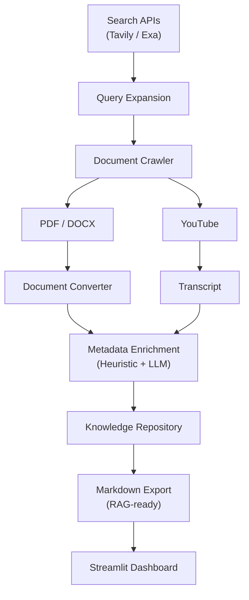

# 📚 DocsCrawler — Automated Educational Data Ingestion Pipeline

[](#)
[](#)
[](#)

DocsCrawler is a robust, end-to-end data engineering pipeline designed to automate the collection, extraction, and standardization of educational materials from the web. It processes raw data (PDF, DOCX, HTML, YouTube) and utilizes a combination of deterministic heuristics and Local LLMs to enrich metadata. The final output is structured, RAG-ready Markdown, primed for downstream AI and machine learning applications.

---

## 🏗️ System Architecture

The pipeline is designed with modularity and scalability in mind, handling everything from web scraping to LLM-powered metadata enrichment.



---

## ✨ Core Features

- **Omni-Channel Ingestion**: Automatically aggregates data from multiple formats including PDFs, DOCX, and raw HTML via advanced search APIs (Tavily/Exa).
- **Multimedia Processing**: Features a specialized YouTube crawler to extract transcripts and perform automated translations.
- **RAG-Ready Conversion**: Seamlessly converts unstructured documents into precisely formatted Markdown with accurate pagination, optimized for Retrieval-Augmented Generation (RAG) systems.
- **Cost-Effective LLM Enrichment**: Employs a dual-layered metadata classification system combining hardcoded heuristics with localized LLM processing (Ollama/Llama3), completely eliminating external API costs.
- **Interactive Dashboard**: Includes a Streamlit-based web interface for real-time monitoring, job management, and analytics visualization.

---

## 🚀 Getting Started

### Prerequisites
- Python **3.11+**
- [**Ollama**](https://ollama.com) running locally with `llama3` or `llama3.1` model
- API keys for **Tavily** or **Exa**

### Installation
```bash
# 1. Create a virtual environment
python -m venv venv
source venv/bin/activate        # On Windows: venv\Scripts\activate

# 2. Install dependencies
pip install -e .

# 3. Environment configuration
cp .env.example .env
```

### Configuration (`.env`)
Configure your `.env` file with the necessary API keys. 
> [!WARNING]
> Your `.env` file contains sensitive API keys. It is included in `.gitignore` to prevent accidental exposure to version control. Do not commit this file.

```env
TAVILY_API_KEY=tvly-xxx         # Or EXA_API_KEY=exa-xxx
OLLAMA_HOST=http://localhost:11434
OLLAMA_MODEL=llama3
MAX_REQUESTS_PER_SECOND=1.0
```

---

## 🖥️ Usage

### Web Interface (Recommended)
Launch the Streamlit dashboard for a user-friendly management interface:
```bash
streamlit run src/dashboard/app.py
```
*Access the dashboard at `http://localhost:8501`.*

### Command Line Interface (CLI)
Execute crawling jobs directly from the terminal:
```bash
python -m src.main \
  --queries "bài giảng toán 5 tuổi" \
  --provider tavily \
  --limit 5 \
  --semaphore 3
```

---

## 📂 Project Structure

```text
.
├── src/            # Core source code (Crawlers, Converters, Enrichers, Dashboard)
├── data/           # Storage for raw, converted, and exported datasets
├── tests/          # Comprehensive test suite (pytest)
├── logs/           # Execution and error logs
└── pyproject.toml  # Project metadata and dependencies
```

---

## 🧪 Testing

The project maintains high reliability through a comprehensive suite of unit and integration tests.

```bash
# Run the full test suite
pytest tests/ -v
```
