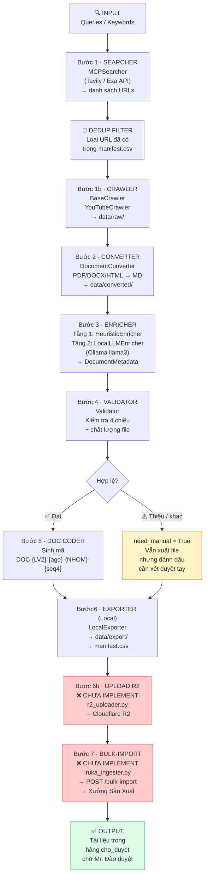
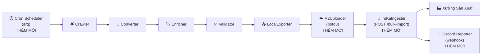

# 🏗️ Kiến trúc Hệ thống & Workflows — IruKa Crawler

> **Phiên bản:** Demo · Local Standalone (G1)
> **Cập nhật:** 10-07-2026
> **Repo:** `iruka-edu/data-cur`

---

## Mục lục

1. [Tổng quan Kiến trúc](#1-tổng-quan-kiến-trúc)
2. [Sơ đồ Pipeline 7 Bước](#2-sơ-đồ-pipeline-7-bước)
3. [Luồng Xử lý Chi tiết](#3-luồng-xử-lý-chi-tiết)
4. [Cấu trúc Module](#4-cấu-trúc-module)
5. [Luồng Dữ liệu (Data Flow)](#5-luồng-dữ-liệu-data-flow)
6. [Chuẩn Taxonomy IruKa](#6-chuẩn-taxonomy-iruka)
7. [Kiến trúc Metadata Enrichment](#7-kiến-trúc-metadata-enrichment)
8. [Dashboard Architecture](#8-dashboard-architecture)
9. [Lộ trình Kiến trúc G2/G3](#9-lộ-trình-kiến-trúc-g2g3)

---

## 1. Tổng quan Kiến trúc

IruKa Crawler là một **hệ thống ETL chuyên biệt** cho tài liệu giáo dục mầm non. Hệ thống vận hành theo mô hình **Pipeline bất đồng bộ** (async pipeline), trong đó mỗi URL được xử lý song song qua 7 bước tuần tự.

### Nguyên tắc thiết kế

| Nguyên tắc | Cách áp dụng |
|---|---|
| **Single Source of Truth** | `taxonomy.py` định nghĩa toàn bộ chuẩn phân loại — tất cả module import từ đây |
| **Fail-safe** | Tài liệu không đạt chuẩn → `need_manual=True`, không bao giờ bị mất |
| **Dedup ở nhiều tầng** | URL (manifest.csv) + nội dung (SHA-256 hash) |
| **Async-first** | `asyncio.gather` + `Semaphore` cho phép crawl 5 URL song song |
| **Zero-cost LLM** | Ollama/llama3 chạy local, không tốn API fees |
| **Immutable Taxonomy** | Không tự chế loại mới — giá trị không khớp → `"khac"` |

---

## 2. Sơ đồ Pipeline 7 Bước



---

## 3. Luồng Xử lý Chi tiết

### 3.1 · Luồng URL (Happy Path)

```
Query "bài giảng mầm non 5 tuổi"
    │
    ▼
MCPSearcher.search(query, limit=10)
    │  Gọi Tavily hoặc Exa API
    │  Trả về: ["https://mamnon.com/...", "https://moet.gov.vn/..."]
    │
    ▼
DEDUP FILTER
    │  Đọc manifest.csv → existing_urls (set)
    │  Lọc: all_urls = [u for u in set(raw) if u not in existing_urls]
    │
    ▼
asyncio.gather(process_url(url) for url in all_urls)
    │  Semaphore(5) — tối đa 5 URL chạy song song
    │
    ▼ [mỗi URL]
EARLY FILTER
    │  Bỏ qua: lop-2, lop-3, ..., thcs, thpt, dai-hoc
    │
    ▼
CRAWLER (Bước 1b)
    │  Nếu youtube.com → YouTubeCrawler.download_file()
    │  Nếu khác       → BaseCrawler.download_file()
    │     ├─ Check robots.txt (urllib.robotparser)
    │     ├─ Rate limit: asyncio.sleep() giữa các request/domain
    │     ├─ Download file (httpx với retry backoff)
    │     └─ Lưu vào data/raw/{sha256}.{ext}
    │
    ▼
CONVERTER (Bước 2)
    │  PDF  → PyMuPDF: extract text từng trang, chèn "--- Trang N ---"
    │  DOCX → python-docx + mammoth: chèn "--- Phần N ---" mỗi 500 từ
    │  HTML → html2text + BeautifulSoup: bóc tag, giữ heading
    │  Lưu vào data/converted/{sha256}.md
    │
    ▼
HEURISTIC ENRICHER (Bước 3, Tầng 1)
    │  Input: name (file stem / HTML title), url
    │  Decode URL → string searchable
    │  Áp bảng quy đổi §5.6:
    │     ├─ Domain → source_tier (DOMAIN_TIER_MAP)
    │     ├─ Domain → doc_type override (DOMAIN_DOCTYPE_MAP)
    │     ├─ Từ khóa tên → linh_vucs ("toán" → nhan_thuc)
    │     ├─ Từ khóa tên → sub_domain_ids ("chữ cái" → nn.doc_viet)
    │     ├─ Từ khóa tên → age_bands ("5 tuổi" → 56)
    │     └─ Từ khóa tên → doc_type ("giáo án" → gt.giao_an)
    │  Output: DocumentMetadata (partial)
    │
    ▼
SITE METADATA OVERRIDE
    │  siteMetadataMapper.get_metadata_override(url)
    │  Ghi đè source_tier / doc_type từ domain config
    │
    ▼
HTML TITLE EXTRACTOR (nếu tên là hash)
    │  Nếu doc_name có 64 ký tự (SHA-256) → extract_page_title(url)
    │
    ▼
LOCAL LLM ENRICHER (Bước 3, Tầng 2 — chỉ khi chưa đủ 4 chiều)
    │  DocumentMetadata.is_valid() == False → gọi Ollama
    │  Đọc 1200 ký tự đầu file MD → preview
    │  Prompt chuẩn hóa: chỉ cho phép giá trị trong taxonomy
    │  Response: JSON {linh_vucs, age_bands, doc_type, sub_domain_ids, source_tier}
    │  Merge vào metadata (không ghi đè giá trị đã có từ heuristic)
    │
    ▼
VALIDATOR (Bước 4)
    │  validate_file(md_path):
    │     ├─ File tồn tại và đọc được
    │     ├─ Kích thước: 500 byte < size < 5MB
    │     └─ Tỷ lệ ký tự chữ/số ≥ 0.1 (lọc file rác)
    │  validate_metadata(meta):
    │     ├─ Lọc linh_vucs: chỉ giữ giá trị trong VALID_LINH_VUCS
    │     ├─ Lọc age_bands: chỉ giữ giá trị trong VALID_AGE_BANDS
    │     ├─ Chuẩn hóa doc_type: không hợp lệ → "khac"
    │     ├─ Lọc sub_domain_ids: chỉ giữ giá trị trong VALID_SUB_DOMAIN_IDS
    │     └─ Check: linh_vucs, age_bands không rỗng, doc_type không "khac",
    │              source_tier ∈ {1,2,3}
    │  need_manual = True nếu validate fail HOẶC doc_type == "khac"
    │
    ▼
LOCAL EXPORTER (Bước 5 + 6 local)
    │  Sinh doc_code: DOC-{LV2}-{age}-{NHOM}-{seq4}
    │     ├─ LV2: viết tắt linh_vuc (NT/NN/TM/TC/TX)
    │     ├─ age: age_band đầu tiên (34/45/56/g1)
    │     ├─ NHOM: doc_group (PL/SGK/GT/BT/KN/NC/MD)
    │     └─ seq4: đọc manifest để tính số tiếp theo
    │  Tạo file MD với YAML Frontmatter
    │  Lưu vào data/export/{doc_code}__{slug}.md
    │  Ghi 1 dòng vào manifest.csv
    │
    ▼
Return: "SUCCESS" | "MANUAL" | "FAILED"
```

### 3.2 · Luồng YouTube

```
URL: "https://youtube.com/watch?v=xxx"
    │
    ▼
YouTubeCrawler.download_file(url)
    │  youtube_transcript_api.get_transcript(video_id)
    │  Thử ngôn ngữ: ["vi", "en", "auto"]
    │  Nếu không có vi → dịch tự động sang vi
    │  Format transcript → Markdown
    │  Lưu thẳng vào data/converted/ (không qua Converter)
    │
    ▼
→ Tiếp tục từ bước HEURISTIC ENRICHER
```

---

## 4. Cấu trúc Module

```
irukacrawler/
├── src/
│   ├── __init__.py
│   ├── models.py                   # DocumentDTO + DocumentMetadata (Pydantic)
│   ├── taxonomy.py                 # 🔑 Single Source of Truth — VALID_*, DOMAIN_MAP
│   ├── main.py                     # CLI entry + async pipeline orchestrator
│   │
│   ├── searcher/
│   │   └── MCPSearcher.py          # Tìm kiếm URL qua Tavily/Exa API
│   │
│   ├── crawlers/
│   │   ├── documentCrawlers.py     # BaseCrawler: download PDF/DOCX/HTML
│   │   ├── youtubeCrawler.py       # YouTubeCrawler: lấy transcript
│   │   └── siteMetadataMapper.py   # Domain → metadata override rules
│   │
│   ├── converters/
│   │   └── documentConverter.py   # PDF/DOCX/HTML → Markdown
│   │
│   ├── enricher/
│   │   ├── heuristicEnricher.py   # Bảng quy đổi §5.6 (keywords/domain → metadata)
│   │   ├── localLLMEnricher.py    # Ollama/llama3 — phân tích ngữ nghĩa
│   │   └── validator.py           # Kiểm tra 4 chiều + chất lượng file
│   │
│   ├── exporter/
│   │   └── LocalExporter.py       # Sinh doc_code, YAML frontmatter, manifest.csv
│   │
│   ├── uploader/                  # ❌ Chưa implement (G2)
│   │   ├── r2_uploader.py         # (placeholder) boto3 → Cloudflare R2
│   │   └── iruka_ingester.py      # (placeholder) POST /bulk-import → be-hub
│   │
│   └── dashboard/
│       ├── app.py                 # Streamlit entry point (4 pages)
│       ├── utils.py               # Đọc manifest, gọi subprocess pipeline
│       └── components/
│           ├── tabThuThap.py      # Tab: Tìm & Thu thập (trigger pipeline)
│           ├── tabThongKe.py      # Tab: Thống kê (biểu đồ Plotly)
│           ├── tabDanhSach.py     # Tab: Danh sách tài liệu (bảng lọc)
│           └── tabXetDuyet.py     # Tab: Xét duyệt (duyệt need_manual)
│
├── config/                        # (placeholder) sources.yaml, taxonomy.yaml
├── data/
│   ├── raw/                       # File gốc: {sha256}.{pdf|docx|html}
│   ├── converted/                 # Markdown tạm: {sha256}.md
│   └── export/                    # Markdown hoàn chỉnh + manifest.csv
│
├── tests/
│   ├── conftest.py
│   ├── test_crawler.py
│   ├── test_flow.py               # Integration test toàn pipeline
│   ├── test_heuristic_enricher.py
│   ├── test_models.py
│   ├── test_taxonomy.py
│   └── test_validator.py
│
├── logs/                          # crawler_{YYYY-MM-DD}.log (loguru, rotation 10MB)
├── Dockerfile
├── docker-compose.yml
├── pyproject.toml                 # uv/pip dependencies
└── pytest.ini
```

---

## 5. Luồng Dữ liệu (Data Flow)

### 5.1 · Vòng đời của 1 tài liệu

```
[Internet]
    │ URL
    ▼
data/raw/{sha256}.pdf           ← File gốc (bất biến)
    │
    ▼
data/converted/{sha256}.md      ← Markdown tạm (chưa có metadata)
    │
    ▼
DocumentMetadata (Pydantic)     ← Object trong bộ nhớ
    │
    ▼
DocumentDTO (Pydantic)          ← Wrapper: metadata + paths + need_manual + doc_code
    │
    ├──► data/export/{doc_code}__{slug}.md   ← File cuối: MD + YAML Frontmatter
    └──► data/export/manifest.csv            ← 1 dòng ghi nhận
```

### 5.2 · Format file xuất (`data/export/`)

```markdown
---
name: "Bài học đếm đến 10 cho bé 5 tuổi"
source_url: "https://mamnon.com/bai-hoc-dem-den-10"
crawled_at: "2026-07-08T14:30:00"
linh_vucs: ["nhan_thuc"]
age_bands: ["56"]
doc_type: "kn.kinh_nghiem"
doc_group: "KN"
source_tier: 1
sub_domain_ids: ["nt.toan"]
skill_ids: []
level_ids: []
series_code: ""
origin_country: "vn"
language: "vi"
school_readiness: false
license: "public-web"
---

# Bài học đếm đến 10 cho bé 5 tuổi

--- Trang 1 ---

## Mục tiêu bài học
...
```

### 5.3 · Format `manifest.csv`

```csv
doc_code,name,source_url,linh_vucs,age_bands,doc_type,source_tier,need_manual,exported_at,md_path
DOC-NT-56-KN-0001,"Bài học đếm đến 10",https://mamnon.com/...,['nhan_thuc'],['56'],kn.kinh_nghiem,1,False,2026-07-08T14:30:00,data/export/DOC-NT-56-KN-0001__bai-hoc-dem-den-10.md
```

---

## 6. Chuẩn Taxonomy IruKa

> **Nguồn gốc:** `taxonomy.py` — Single Source of Truth cho toàn bộ hệ thống.

### 6.1 · 4 Chiều Bắt buộc

```
DocumentMetadata
├── linh_vucs: List[str]     → VALID_LINH_VUCS (5 giá trị)
├── age_bands: List[str]     → VALID_AGE_BANDS (5 giá trị*)
├── doc_type: str            → VALID_DOC_TYPES (25 loại + "khac")
└── source_tier: int         → VALID_SOURCE_TIERS {1, 2, 3}

*Lưu ý: g1 đã được tách thành g1_hk1 / g1_hk2 (cần xác nhận Mr. Đào)
```

### 6.2 · Sơ đồ doc_type → doc_group → zone R2

```
doc_type            doc_group   zone R2
─────────────────── ─────────── ─────────────────────────
pl.chuong_trinh  ┐
pl.chuan_5t      ├─► PL    ──►  01_PL_phap_ly
pl.thong_tu      │
pl.cong_van      ┘

sgk.sgk          ┐
sgk.sbt          ├─► SGK   ──►  02_SGK_hoc_lieu
sgk.sgv          │
sgk.tap_to       ┘

gt.truong        ┐
gt.quoc_te       ├─► GT    ──►  03_GT_giao_trinh_truong
gt.giao_an       ┘

bt.nang_cao      ┐
bt.bo_tro        ├─► BT    ──►  04_BT_bo_tro_nang_cao
bt.truyen_tho    │
bt.ky_nang       ┘

kn.kinh_nghiem   ┐
kn.skkn          ├─► KN    ──►  05_KN_kinh_nghiem
kn.meo_day       │
kn.du_gio        ┘

nc.nghien_cuu    ┐
nc.bai_bao       ├─► NC    ──►  06_NC_nghien_cuu
nc.tap_huan      │
nc.ct_nuoc_ngoai ┘

md.hinh_anh      ┐
md.am_thanh      ├─► MD    ──►  07_MD_media
md.video         ┘

khac             ──► KHAC  ──►  00_Khac
```

### 6.3 · Domain → source_tier (tự động)

| Domain | Tier | Nhóm |
|---|---|---|
| `moet.gov.vn` | 3 ⭐⭐⭐ | A — Bộ GD |
| `csdl.hcm.edu.vn` | 3 ⭐⭐⭐ | A — Sở GD |
| `hanoi.edu.vn` | 3 ⭐⭐⭐ | A — Sở GD |
| `taphuan.csdl.edu.vn` | 3 ⭐⭐⭐ | A — Tập huấn BỘ |
| `hoc10.vn` | 2 ⭐⭐ | B — SGK chính thống |
| `vietjack.com` | 2 ⭐⭐ | B — SGK |
| `sachmem.vn` | 2 ⭐⭐ | B — SGK |
| `nxbgd.vn` | 2 ⭐⭐ | B — NXB Giáo dục |
| `giaovienmamnon.com` | 1 ⭐ | C — Blog GV |
| `mamnon.com` | 1 ⭐ | C — Blog |
| `kinderart.com` | 1 ⭐ | C — Blog quốc tế |

---

## 7. Kiến trúc Metadata Enrichment

### 7.1 · Two-tier Enrichment Flow

```
              ┌─────────────────────────────────────┐
              │           HEURISTIC ENRICHER         │
              │                                     │
Input ──────► │  URL decode + name lowercase        │
(name, url)   │  ↓                                  │
              │  Domain matching:                   │
              │    DOMAIN_TIER_MAP    → source_tier  │
              │    DOMAIN_DOCTYPE_MAP → doc_type     │
              │  ↓                                  │
              │  Keyword matching (remove_accents):  │
              │    "toan", "dem" → nhan_thuc         │
              │    "chu cai"     → ngon_ngu           │
              │    "giao an"     → gt.giao_an        │
              │    "5 tuoi"      → age_band=56       │
              │    ...                              │
              └──────────────┬──────────────────────┘
                             │
                  DocumentMetadata.is_valid()?
                             │
              ┌──────────────┴──────────────────────┐
              │ NO: Thiếu ≥ 1 trong 4 chiều         │
              │                                     │
              │         LOCAL LLM ENRICHER          │
              │                                     │
              │  Đọc 1200 ký tự đầu file .md        │
              │  Build prompt với taxonomy chuẩn    │
              │  Ollama.chat(llama3, format="json")  │
              │  Parse JSON response                 │
              │  Merge vào metadata (non-overwrite)  │
              └─────────────────────────────────────┘
                             │
                             ▼
                   DocumentMetadata (đầy đủ hoặc partial)
                             │
                    ┌────────┴──────────────┐
                    │       VALIDATOR        │
                    │  Lọc giá trị invalid  │
                    │  Check 4 chiều đủ?    │
                    └────────────────────────┘
```

### 7.2 · Quy tắc Merge (Tầng 1 → Tầng 2)

```python
# Heuristic gán xong → chạy LLM nếu chưa đủ
if not meta.is_valid():
    llm_result = await llm_enricher.analyze_document(...)
    # Chỉ merge khi heuristic chưa có giá trị (không ghi đè)
    if not meta.linh_vucs and llm_result.get("linh_vucs"):
        meta.linh_vucs = llm_result["linh_vucs"]
    if not meta.age_bands and llm_result.get("age_bands"):
        meta.age_bands = llm_result["age_bands"]
    if not meta.doc_type and llm_result.get("doc_type"):
        meta.doc_type = llm_result["doc_type"]
    if not meta.source_tier and llm_result.get("source_tier"):
        meta.source_tier = llm_result["source_tier"]
```

### 7.3 · Ngoại lệ Validation (PL / NC)

```
Tài liệu nhóm PL (Pháp lý) và NC (Nghiên cứu):
  ├─ KHÔNG cần age_bands (thông tư áp dụng mọi lứa tuổi)
  └─ KHÔNG cần linh_vucs bắt buộc
  → is_valid() = True nếu có doc_type + source_tier hợp lệ
```

---

## 8. Dashboard Architecture

### 8.1 · Sơ đồ Component

```
Streamlit App (app.py)
    │
    ├── st.navigation([...])
    │
    ├── Page 1: tabThuThap.py — "Tìm & Thu thập"
    │   ├── Form: queries, provider (tavily/exa), limit, semaphore
    │   ├── Trigger: subprocess chạy `python -m src.main --queries ...`
    │   ├── Real-time log: đọc stdout của subprocess
    │   └── Stats: parse "===STATS=== {...}" từ stdout
    │
    ├── Page 2: tabThongKe.py — "Thống kê"
    │   ├── Đọc manifest.csv
    │   └── Vẽ biểu đồ Plotly: phân bố linh_vuc, doc_type, age_band, tier
    │
    ├── Page 3: tabDanhSach.py — "Danh sách tài liệu"
    │   ├── Đọc manifest.csv
    │   ├── Bộ lọc: linh_vuc, doc_type, age_band, need_manual
    │   └── Bảng tài liệu có thể sắp xếp + download
    │
    └── Page 4: tabXetDuyet.py — "Xét duyệt"
        ├── Lọc need_manual=True từ manifest.csv
        ├── Hiển thị nội dung MD để Admin đọc
        └── Form cập nhật metadata → ghi lại manifest.csv
```

### 8.2 · Cơ chế gọi Pipeline từ Dashboard

```
User bấm "Bắt đầu Thu thập"
    │
    ▼
tabThuThap.py
    │  subprocess.Popen([
    │      "python", "-m", "src.main",
    │      "--queries", queries,
    │      "--provider", provider,
    │      "--limit", str(limit),
    │      "--semaphore", str(semaphore)
    │  ], stdout=PIPE, stderr=STDOUT)
    │
    ▼
Đọc stdout từng dòng (real-time)
    │  st.session_state.log_chay.append(line)
    │  Parse "===STATS===" → hiển thị số liệu kết quả
    │
    ▼
st.session_state.trang_thai = "xong" | "loi"
```

---

## 9. Lộ trình Kiến trúc G2/G3

### 9.1 · G2 — Mở rộng (Tuần 5–8)



**Thêm mới trong G2:**

| Component | File | Chức năng |
|---|---|---|
| R2Uploader | `src/uploader/r2_uploader.py` | boto3 PUT file → Cloudflare R2 theo path chuẩn |
| IruKaIngester | `src/uploader/iruka_ingester.py` | POST `/bulk-import` → be-hub API |
| DiscordReporter | `src/notifier/discord_reporter.py` | Gửi báo cáo mẻ vào Discord webhook |
| Scheduler | `src/scheduler.py` | `arq` cron chạy hàng đêm |
| Thêm Crawler | `src/crawlers/mamnon_crawler.py` | Crawler chuyên biệt cho mamnon.com |

### 9.2 · G3 — Chất lượng Cao (Tuần 9–12)

**Thêm mới trong G3:**

| Component | Chức năng |
|---|---|
| OCRConverter | Tesseract / Google Vision cho SGK scan ảnh |
| EmbeddingDedup | Dedup nâng cao: cosine similarity để phát hiện tài liệu gần trùng |
| SkillClassifier | Tự động gán `skill_ids` (30 kỹ năng) bằng LLM |
| ConfidenceScorer | Gắn confidence score < 0.7 → auto `need_manual` |

### 9.3 · Target Architecture (Production)

```
[Cronjob đêm]
    │ arq.enqueue()
    ▼
[Worker Pool]
    ├── MCPSearcher (Tavily/Exa)
    ├── BaseCrawler (5 domain parallel)
    │   ├── BaseCrawler (httpx/Playwright)
    │   └── YouTubeCrawler
    ├── DocumentConverter (PDF/DOCX/HTML/OCR)
    ├── HeuristicEnricher
    ├── LocalLLMEnricher (Ollama llama3)
    ├── Validator
    ├── LocalExporter → manifest.csv
    ├── R2Uploader → Cloudflare R2
    └── IruKaIngester → be-hub API

[Monitoring]
    ├── loguru → logs/crawler_{date}.log
    └── Discord webhook → #crawler-report

[Dashboard - Streamlit]
    ├── Thống kê real-time từ manifest.csv
    └── Xét duyệt need_manual items
```

---

## Phụ lục: Biến Môi trường Cần thiết

```bash
# ── Search API ────────────────────────────────────
TAVILY_API_KEY=tvly-xxx          # Tìm kiếm URL qua Tavily
EXA_API_KEY=exa-xxx              # Tìm kiếm URL qua Exa

# ── LLM (Ollama) ──────────────────────────────────
OLLAMA_HOST=http://localhost:11434
OLLAMA_MODEL=llama3              # hoặc llama3.1

# ── Crawler Config ────────────────────────────────
MAX_REQUESTS_PER_SECOND=1.0
USER_AGENT="IruKa-Educational-Crawler/1.0 (contact: mr.dao@irukaedu.vn)"

# ── Cloudflare R2 (G2+) ───────────────────────────
R2_ENDPOINT_URL=https://xxx.r2.cloudflarestorage.com
R2_ACCESS_KEY_ID=xxx
R2_SECRET_ACCESS_KEY=xxx
R2_BUCKET_NAME=iruka-kho-tai-lieu

# ── IruKa API (G2+) ──────────────────────────────
IRUKA_ADMIN_TOKEN=Bearer_xxx
IRUKA_HUB_API_URL=https://hub-api.irukaedu.vn

# ── Discord (G2+) ────────────────────────────────
DISCORD_WEBHOOK_URL=https://discord.com/api/webhooks/xxx
```

---

*Tài liệu kiến trúc — IruKa Team · 10-07-2026*
