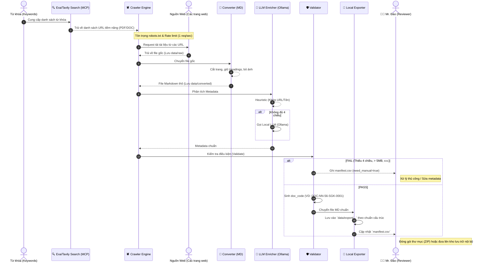

# 🔄 Flow-Roles: Luồng Công Việc & Phân Quyền Xử Lý (Phiên bản Độc lập)

Dựa trên các yêu cầu về hệ thống cào tài liệu độc lập (không phụ thuộc API bên thứ 3 và Cloudflare R2), dưới đây là **Sơ đồ luồng công việc (Workflow)** kết hợp **Phân chia vai trò (Roles)** giữa Hệ thống tự động và Con người.

## 1. Sơ đồ Flow-Roles (Mermaid)

---

## 2. Phân tách Vai trò (Roles) chi tiết

### 🤖 Role 1: Hệ thống Tự động (Crawler Bot / Pipeline)
Đây là phần mã nguồn (tool) mà Developer phải xây dựng, chạy hoàn toàn tự động không cần người can thiệp trong quá trình thực thi:

* **Crawler Engine:**
  * **Trách nhiệm:** Đi lấy dữ liệu về.
  * **Ràng buộc đạo đức/kỹ thuật:** Phải tuân thủ `robots.txt`, set **Rate limit tối đa 1 req/sec/domain** để không gây DDoS, trung thực khai báo User-Agent (`IruKa-Educational-Crawler`), và xử lý chống trùng lặp (Dedup bằng Hash).
* **Document Converter:**
  * **Trách nhiệm:** Chuẩn hoá mọi định dạng (PDF/DOCX) về định dạng Markdown chuẩn của IruKa.
  * **Quy tắc:** Thêm mốc `--- Trang N ---`, giữ nguyên Heading, loại bỏ ảnh (chỉ để lại text mô tả).
* **Metadata Enricher:**
  * **Trách nhiệm:** Dán nhãn (tagging) tài liệu dựa trên 4 chiều bắt buộc.
  * **Quy tắc:** Tự động suy luận dựa trên tập luật (Heuristic) trước. Nếu thiếu, gọi API LLM giá rẻ (như `gpt-5-mini`) để trích xuất theo đúng Schema.
* **Validator & Ingester:**
  * **Trách nhiệm:** Kiểm soát chất lượng trước khi nạp vào hệ thống chính và thực hiện tích hợp.
  * **Quy tắc:** Chặn các file rác (dưới 500 ký tự) hoặc quá to (trên 5MB). Upload an toàn lên Cloudflare R2 và gọi hàm API `bulk-import` đẩy vào hàng chờ.

### 👨‍🏫 Role 2: Quản trị viên / Người kiểm duyệt (Mr. Đào)
Đây là con người, can thiệp ở các chốt chặn cuối cùng hoặc khi hệ thống tự động không chắc chắn:

* **Xử lý ngoại lệ (Manual Review):**
  * **Trách nhiệm:** Xử lý các tài liệu mà Validator đánh dấu `need_manual=true` trong file `manifest.csv`.
  * **Hành động:** Điền thêm metadata bị thiếu bằng tay, hoặc quyết định bỏ qua file rác.
* **Kiểm duyệt cuối cùng (Final Approval):**
  * **Trách nhiệm:** Đảm bảo dữ liệu nạp vào "Não AI" là sạch và chuẩn xác 100%.
  * **Hành động:** Truy cập trang `cur.irukaedu.vn/xuong-san-xuat`, xem danh sách tài liệu đang ở trạng thái `cho_duyet`, lướt qua một lượt và bấm **Duyệt**. (Sau bước này, dữ liệu mới thực sự được băm vector đưa vào RAG).
* **Giám sát hệ thống:**
  * Xem báo cáo mẻ chạy từ Discord Webhook để theo dõi tiến độ (cào được bao nhiêu, lỗi bao nhiêu).

---

## 3. Quản lý Vòng đời Tài liệu (Trạng thái)

1. `RAW`: Đang lưu ở máy local (`data/raw/`).
2. `CONVERTED`: Đã thành file `.md` tại local (`data/converted/`).
3. `ENRICHED`: Đã có đủ frontmatter metadata.
4. `NEED_MANUAL`: (Nhánh phụ) Lỗi Validate, đợi Admin sửa tay.
5. `PENDING_REVIEW` (`cho_duyet`): Đã nằm trên R2 và DB IruKa, đang đợi Admin duyệt trên giao diện Web.
6. `APPROVED`: Admin đã duyệt, Não AI đang băm dữ liệu.
