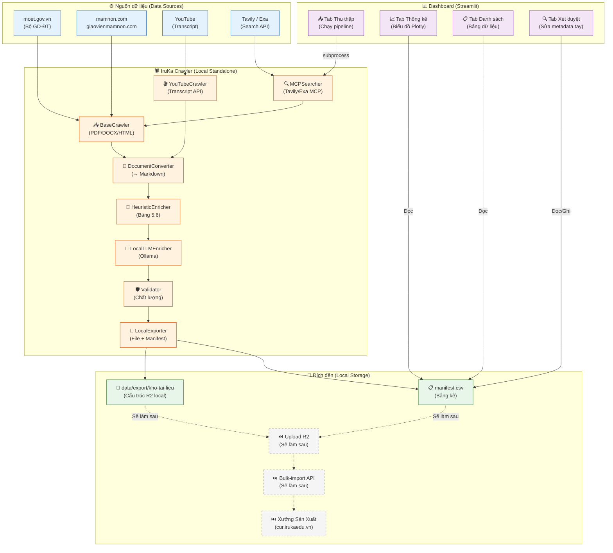
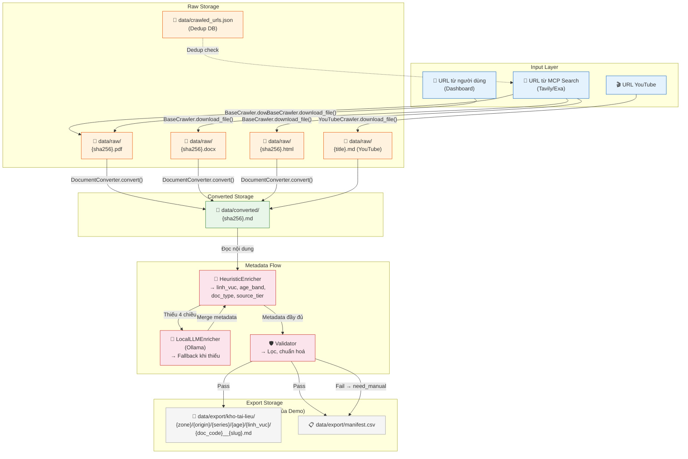
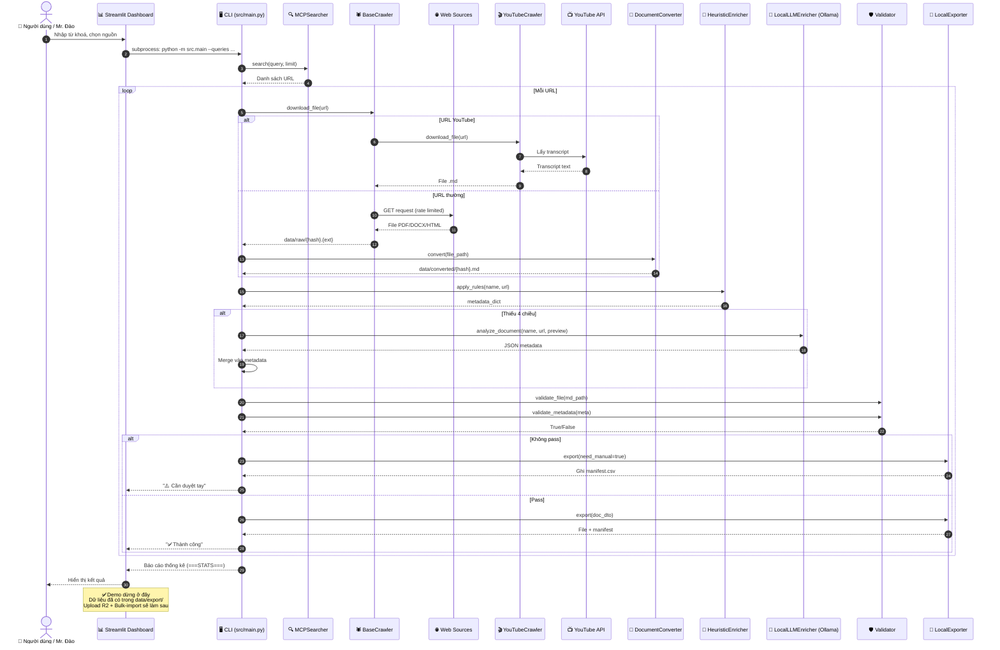
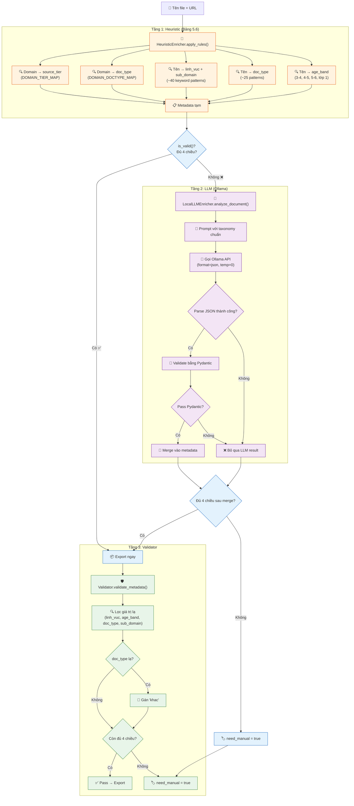
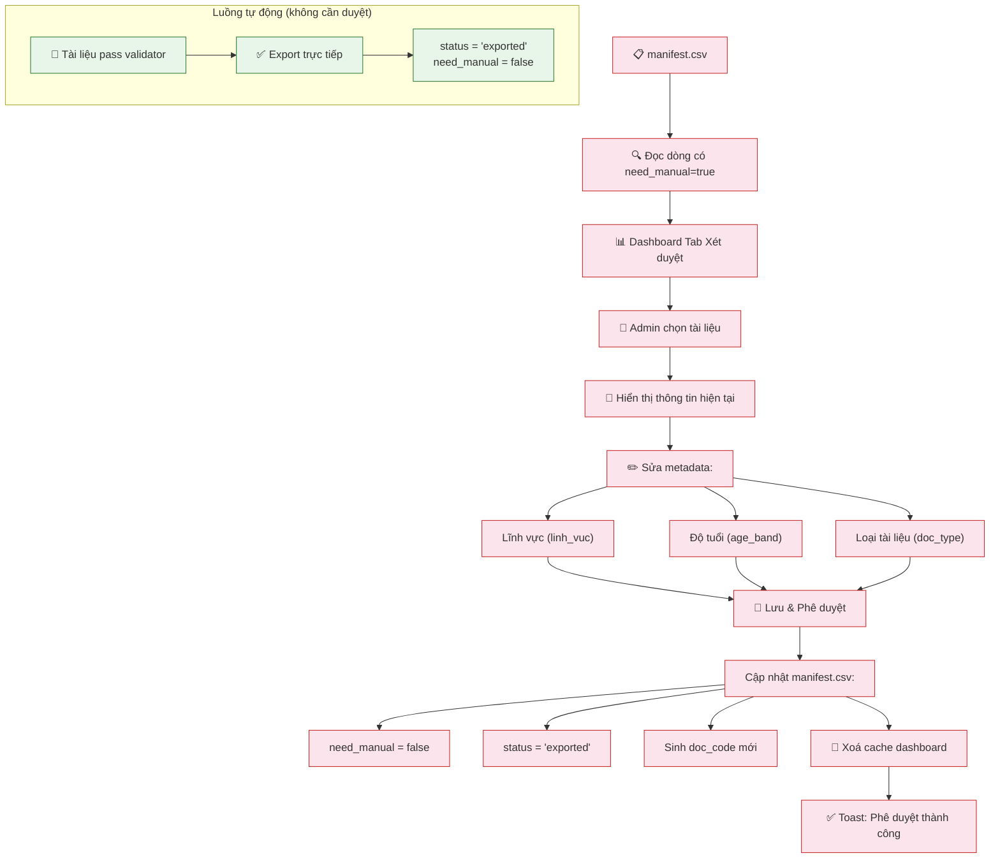
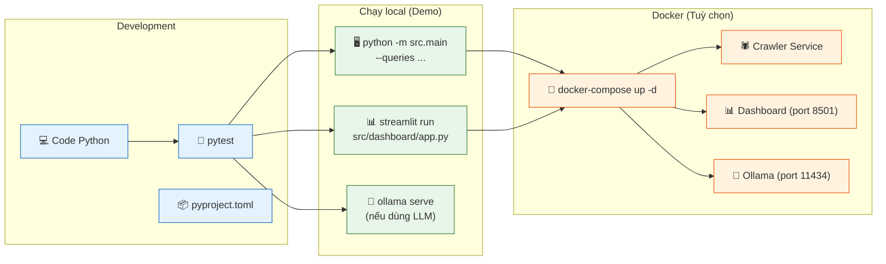
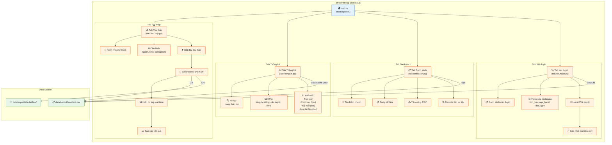

# 🔄 Workflows & Sơ đồ Luồng Hoạt động — Hệ thống Cào tài liệu IruKa

> **Phiên bản:** Demo / Local Standalone
> **Dựa trên:** `08-07-2026__dev-ops__plan-he-thong-cao-tai-lieu-tham-khao.md`
> **Trạng thái đánh giá:** 2026-07-09
>
> ⚠️ **Ghi chú quan trọng:** Đây là bản **demo** nên các dịch vụ bên thứ 3 (Cloudflare R2, OpenAI, Discord webhook, VPS Vultr...) và các tính năng trả phí đều được **scale nhỏ lại** hoặc để ở chế độ "sẽ làm sau". Hệ thống hiện tại chạy **100% local** không phụ thuộc internet (ngoại trừ MCP Search và YouTube Transcript API).

---

## Mục lục

1. [Kiến trúc tổng thể (System Architecture)](#1-kiến-trúc-tổng-thể)
2. [Pipeline 7 bước chi tiết (7-Step Pipeline)](#2-pipeline-7-bước-chi-tiết)
3. [Luồng dữ liệu (Data Flow)](#3-luồng-dữ-liệu)
4. [Vòng đời tài liệu (Document Lifecycle)](#4-vòng-đời-tài-liệu)
5. [Luồng tương tác thành phần (Component Interaction)](#5-luồng-tương-tác-thành-phần)
6. [Luồng xử lý metadata (Metadata Enrichment Flow)](#6-luồng-xử-lý-metadata)
7. [Luồng xét duyệt (Review Flow)](#7-luồng-xét-duyệt)
8. [Luồng triển khai (Deployment Flow)](#8-luồng-triển-khai)
9. [Luồng dashboard (Dashboard UI Flow)](#9-luồng-dashboard)
10. [So sánh trạng thái hiện tại vs yêu cầu](#10-so-sánh-trạng-thái-hiện-tại-vs-yêu-cầu)

---

## 1. Kiến trúc tổng thể



---

## 2. Pipeline 7 bước chi tiết

```mermaid
flowchart LR
    subgraph "Bước 1: Tìm kiếm & Cào"
        direction TB
        S1["🔍 MCPSearcher<br/>Tavily / Exa"] --> S2["🕷️ Crawl URL<br/>BaseCrawler"]
        S2 --> S3{"Định dạng?"}
        S3 -->|PDF| S4["📄 PyMuPDF"]
        S3 -->|DOCX| S5["📝 python-docx"]
        S3 -->|HTML| S6["🌐 BeautifulSoup"]
        S3 -->|YouTube| S7["🎬 Transcript API"]
    end

    subgraph "Bước 2: Convert → Markdown"
        direction TB
        C1["📄 File gốc"] --> C2["📝 DocumentConverter"]
        C2 --> C3["➕ Thêm --- Trang N ---"]
        C2 --> C4["🔤 Giữ Heading (H1-H3)"]
        C2 --> C5["🖼️ Bỏ ảnh → [Ảnh: ...]"]
        C2 --> C6["💾 data/converted/*.md"]
    end

    subgraph "Bước 3: Enrich Metadata"
        direction TB
        E1["📄 File MD"] --> E2["🧠 HeuristicEnricher<br/>(Bảng 5.6)"]
        E2 --> E3{"Đủ 4 chiều?"}
        E3 -->|Có| E4["✅ Metadata tạm"]
        E3 -->|Không| E5["🤖 LocalLLMEnricher<br/>(Ollama)"]
        E5 --> E6["📋 JSON metadata"]
        E6 --> E4
    end

    subgraph "Bước 4: Validate"
        direction TB
        V1["📄 File + Metadata"] --> V2["🛡️ Validator"]
        V2 --> V3{"File > 500 ký tự?"}
        V3 -->|Không| V4["❌ need_manual=true"]
        V3 -->|Có| V5{"File < 5MB?"}
        V5 -->|Không| V4
        V5 -->|Có| V6{"Đủ 4 chiều?"}
        V6 -->|Không| V4
        V6 -->|Có| V7{"doc_type hợp lệ?"}
        V7 -->|Không| V8["🔄 Gán 'khac'"]
        V8 --> V4
        V7 -->|Có| V9["✅ Pass"]
    end

    subgraph "Bước 5: Sinh doc_code"
        direction TB
        D1["✅ Pass"] --> D2["🏷️ Sinh mã<br/>DOC-{LV2}-{age}-{NHOM}-{seq4}"]
        D2 --> D3["Ví dụ:<br/>DOC-NN-56-SGK-0001"]
    end

    subgraph "Bước 6: Export Local"
        direction TB
        X1["📄 File MD + Metadata"] --> X2["📁 LocalExporter"]
        X2 --> X3["📂 data/export/kho-tai-lieu/<br/>{zone}/{origin}/{series}/{age}/{linh_vuc}/"]
        X2 --> X4["📋 manifest.csv"]
        X3 --> X5["💾 File .md có frontmatter YAML"]
    end

    subgraph "Bước 7: Upload & Import (⏭️ Sẽ làm sau)"
        direction TB
        U1["📂 File export"] -.-> U2["☁️ Upload R2<br/>(presigned URL)"]
        U2 -.-> U3["🏭 Bulk-import API"]
        U3 -.-> U4["✅ Xưởng Sản Xuất<br/>cho_duyet"]
    end

    S4 --> C1
    S5 --> C1
    S6 --> C1
    S7 --> C1
    C6 --> E1
    E4 --> V1
    V9 --> D1
    D3 --> X1
    X5 -.-> U1

    classDef step1 fill:#e3f2fd,stroke:#1565c0
    classDef step2 fill:#fff3e0,stroke:#e65100
    classDef step3 fill:#e8f5e9,stroke:#2e7d32
    classDef step4 fill:#fce4ec,stroke:#c62828
    classDef step5 fill:#f3e5f5,stroke:#6a1b9a
    classDef step6 fill:#e0f2f1,stroke:#00695c
    classDef step7 fill:#f5f5f5,stroke:#9e9e9e,stroke-dasharray: 5 5

    class S1,S2,S3,S4,S5,S6,S7 step1
    class C1,C2,C3,C4,C5,C6 step2
    class E1,E2,E3,E4,E5,E6 step3
    class V1,V2,V3,V4,V5,V6,V7,V8,V9 step4
    class D1,D2,D3 step5
    class X1,X2,X3,X4,X5 step6
    class U1,U2,U3,U4 step7
```



---

## 3. Luồng dữ liệu



---

## 4. Vòng đời tài liệu

```mermaid
stateDiagram-v2
    [*] --> RAW: Crawl URL thành công
    
    state RAW {
        [*] --> PDF: Đuôi .pdf
        [*] --> DOCX: Đuôi .docx
        [*] --> HTML: Đuôi .html
        [*] --> YT_MD: YouTube transcript
    end
    
    RAW --> CONVERTED: DocumentConverter
    
    CONVERTED --> ENRICHED: HeuristicEnricher
    
    ENRICHED --> NEED_MANUAL: Validator FAIL
    ENRICHED --> PENDING_REVIEW: Validator PASS
    
    state NEED_MANUAL {
        [*] --> CHO_DUYET_TAY: Ghi manifest.csv
        CHO_DUYET_TAY --> DANG_SUA: Admin chọn
        DANG_SUA --> DA_SUA: Lưu metadata
        DA_SUA --> PENDING_REVIEW: Đủ 4 chiều
    end
    
    state PENDING_REVIEW {
        [*] --> CHO_DUYET: Chờ duyệt
        CHO_DUYET --> DA_DUYET: Admin bấm Duyệt
        CHO_DUYET --> TU_CHOI: Admin từ chối
    end
    
    DA_DUYET --> APPROVED: Băm vector
    TU_CHOI --> [*]
    APPROVED --> [*]

    note right of RAW
        Lưu tại data/raw/{hash}.{ext}
        Dedup bằng SHA-256
    end note

    note right of CONVERTED
        Lưu tại data/converted/{hash}.md
        Có mốc --- Trang N ---
    end note

    note right of ENRICHED
        Frontmatter YAML đầy đủ
        4 chiều: linh_vuc, age_band,
        doc_type, source_tier
    end note

    note right of PENDING_REVIEW
        Đã export ra data/export/
        Có trong manifest.csv
        (Demo dừng ở đây — R2 upload
        + bulk-import sẽ làm sau)
    end note
```

---

## 5. Luồng tương tác thành phần



---

## 6. Luồng xử lý metadata



---

## 7. Luồng xét duyệt



---

## 8. Luồng triển khai (Demo)



---

## 9. Luồng dashboard



---

## 10. So sánh trạng thái hiện tại vs yêu cầu

> **Lưu ý:** Đánh giá dưới đây trong bối cảnh **Demo / Local Standalone**. Các mục đánh dấu ⏭️ là "sẽ làm sau" khi chuyển lên production — không ảnh hưởng đến chức năng demo hiện tại.

### 10.1 · Mức độ hoàn thành theo module

| Module | Spec gốc | Trạng thái Demo | % Demo |
|---|---|---|---|
| **Taxonomy** (§5) | 25 doc_type, 7 nhóm, 5 linh_vuc, 12 sub_domain | ✅ Hoàn chỉnh | **100%** |
| **BaseCrawler** (§7.1) | robots.txt, rate limit, dedup, blacklist | ✅ Đầy đủ | **100%** |
| **YouTubeCrawler** (§4.1) | Transcript API, ưu tiên tiếng Việt | ✅ Hoạt động | **100%** |
| **DocumentConverter** (§7.2) | PDF/DOCX/HTML → MD, giữ heading, bỏ ảnh | ✅ Đầy đủ | **100%** |
| **HeuristicEnricher** (§5.6) | Bảng quy đổi 5.6, ~40 patterns | ✅ Rất chi tiết | **100%** |
| **LocalLLMEnricher** (§7.3) | Ollama (local, miễn phí) thay vì OpenAI | ✅ Phù hợp demo | **100%** |
| **Validator** (§7.4) | File check, metadata check, lọc giá trị lạ | ✅ Đầy đủ | **100%** |
| **LocalExporter** (§8) | Frontmatter YAML, cấu trúc thư mục, manifest | ✅ Hoạt động | **100%** |
| **R2 Uploader** (§7.6) | Upload lên Cloudflare R2 | ⏭️ Sẽ làm sau | **—** |
| **Iruka Ingester** (§7.7) | Gọi API bulk-import | ⏭️ Sẽ làm sau | **—** |
| **MCPSearcher** (§6.2) | Tavily + Exa MCP | ✅ Hoạt động | **100%** |
| **Dashboard** (§10 G3) | Streamlit, 4 tab, biểu đồ, xét duyệt | ✅ Rất tốt | **100%** |
| **SiteMetadataMapper** (§4.1) | Metadata override theo domain (12 site, 3 nhóm) | ✅ Hoạt động — vừa thêm | **100%** |
REPLACE
| **Báo cáo Discord** (§8.3) | Webhook báo cáo mẻ chạy | ⏭️ Sẽ làm sau (xem log trên Dashboard) | **—** |
| **OCR** (§10 G3) | Tesseract/Google Vision cho SGK scan | ⏭️ Sẽ làm sau | **—** |
| **Cron job** (§10 G2) | arq/Celery scheduled task | ⏭️ Sẽ làm sau (chạy tay qua Dashboard) | **—** |
| **DMCA/opt-out** (§9.3) | Blacklist source_url, xoá tài liệu | ⏭️ Sẽ làm sau | **—** |
| **Tests** (§11) | pytest, 6 test files, Postman | ✅ Khá tốt | **80%** |

### 10.2 · Tổng quan demo

| Hạng mục | Giá trị |
|---|---|
| **Tổng số module đã hoạt động** | **10/18** module (còn lại ⏭️ sẽ làm sau) |
| **Tỷ lệ hoàn thành trên module demo** | **10/10 = 100%** (các module trong phạm vi demo đều hoạt động) |
| **Số dòng code ước tính** | ~2,000+ lines Python |
| **Số test** | 6 test files, ~80+ test cases |
| **Dependencies** | Python 3.11+, Playwright, PyMuPDF, Ollama, Streamlit, httpx, pandas, plotly |
| **Cách chạy** | `streamlit run src/dashboard/app.py` hoặc `python -m src.main --queries "từ khoá" --provider tavily` |

### 10.3 · Các file gợi ý phát triển sau (khi lên production)

| File | Mục đích | Ghi chú |
|---|---|---|
| `src/uploader/r2_uploader.py` | Upload lên Cloudflare R2 | Cần credentials R2 + API presign |
| `src/uploader/iruka_ingester.py` | Gọi bulk-import API be-hub | Cần IRUKA_ADMIN_TOKEN |
| `src/reporter/discord_reporter.py` | Gửi báo cáo Discord | Cần Discord webhook URL |
| `src/processors/ocr_processor.py` | OCR cho SGK scan | Cần Tesseract / Google Vision |
REPLACE

---

## Chú thích

| Ký hiệu | Ý nghĩa |
|---|---|
| ✅ **Hoạt động** | Module đã được implement và hoạt động trong bản demo |
| ⏭️ **Sẽ làm sau** | Module nằm ngoài phạm vi demo (cần dịch vụ trả phí / production) |
| Đường nét đứt (`-.-` hoặc `-.->`) | Luồng chưa được kết nối (sẽ làm sau) |
| Màu xám | Thành phần nằm ngoài phạm vi demo hiện tại |

---

> **Tài liệu tham khảo:**
> - `08-07-2026__dev-ops__plan-he-thong-cao-tai-lieu-tham-khao.md` — Kế hoạch gốc
> - `workflow_roles.md` — Flow-Roles phiên bản độc lập
> - `src/taxonomy.py` — Chuẩn phân loại IruKa (Single Source of Truth)
> - `src/main.py` — Entry point pipeline